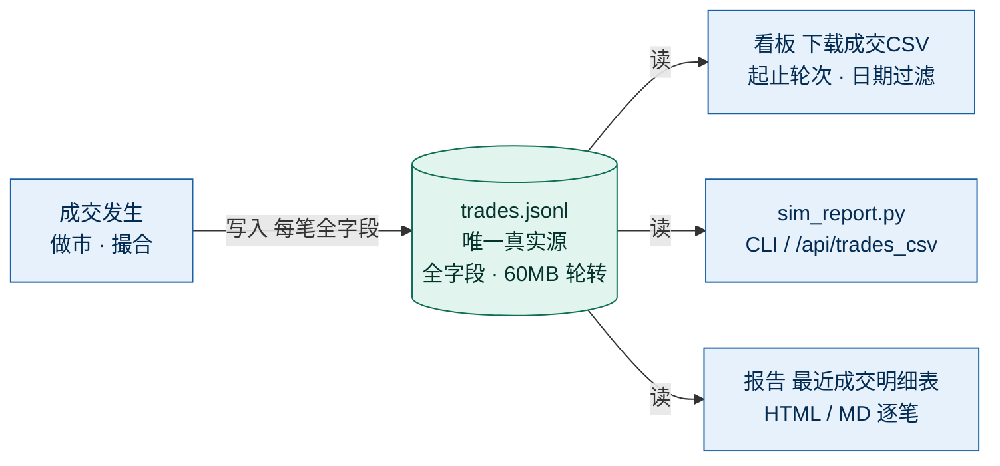

# NB 省实盘部署 SOP（Polymarket-Sim）

> 面向**加拿大 New Brunswick 等开放省**的部署伙伴。物理 IP 落 CA 开放省、无 KYC、可实盘。
> 本文件只讲「怎么把项目拉下来、配好、先模拟跑通、再小资金实盘」。
> 模拟盘主线文档见 `DEPLOY_POLYMARKET.md`；本文件是其实盘增强版。

> **文档时效**：反映至 2026-09-01 迭代，代码 latest `72c8668`（GitHub `landlord2003/Polymarket-Sim` master）。北京实例为 DRY_RUN 模拟盘（零真钱、行情为缓存快照非实时）；NB 开放省部署后自动转实时 `gamma` 盘口。

---

## 0. 上线前必做：IP 自检

Polymarket 按**当前物理出口 IP**判定地区（不看国籍/户籍）。上线前确认 IP 解析到 **CA / New Brunswick（或任一开放省）**：

```bash
curl -s ipinfo.io | python -m json.tool
# 关注 "country": "CA" 与 "region": "New Brunswick"
# 若 region 落在 ON/AB/BC/QC 或 country 非 CA，会被 close-only，先排查网络再继续
```

> ⚠️ **不要挂 VPN**（尤其勿挂到 ON/AB/BC/QC 或受限国，否则直接 close-only / 封锁）。本机直连即可。

---

## 1. 前置条件

| 条件 | 要求 |
|------|------|
| 出口 IP | CA 开放省（见 §0 自检） |
| Python | 3.11+（3.13 已验证） |
| Git | 任意较新版本 |
| 依赖 | `pip install -r requirements_nb.txt`（websockets / py-clob-client / web3） |
| 钱包 | 非托管钱包（MetaMask 等），往 Polymarket 充值地址打 **Polygon 上的 USDC**（最低 $3） |

---

## 2. 克隆 + 环境

```bash
git clone https://github.com/landlord2003/Polymarket-Sim.git
cd Polymarket-Sim
python -m venv .venv && source .venv/bin/activate     # Windows: .venv\Scripts\activate
pip install -r requirements_nb.txt
cp .env.nb .env                                        # 编辑 .env 填真实值
```

---

## 3. 配置 `.env`（关键三项）

| 变量 | 填什么 | 说明 |
|------|--------|------|
| `SHUTDOWN_TOKEN` | 随机长串 | 关停 / kill switch 鉴权，务必改掉弱默认 |
| `PM_BOT_PK` | 你的钱包私钥 | **仅 env，绝不写代码 / 提交**；`LIVE_MODE=1` 时必须 |
| `COMPLIANCE_FILTER` | `0` | NB 无合规风险，关闭过滤，交易所有市场 |
| `LIVE_MODE` | 先 `0` | 先模拟跑通，再改 `1` 小资金实盘 |
| `SIM_MODE` | `inv` | 真实做市（库存管理，跨轮持有敞口、承价格波动、受止损/库存上限）；`pairs` 为旧同轮双边建平 |
| `INITIAL_CAPITAL` | `5000` | 初始资金 USD（重置起点，默认 10000；北京实例设为 5000） |
| `MM_N` | `20` | 同时做市的市场数 |
| `MM_N_PER_CAT` | `5` | **每类做市上限**（保证类别多样性，避免 20 标的挤在 1~2 类）；env 可配 |
| `LIVE_POLL_SEC` | `30` | `LIVE_MODE=1` 时后台每 N 秒轮询在途订单真实成交状态（用于看板真实成交率） |
| `DINGTALK_WEBHOOK` / `DINGTALK_SECRET` | （可选） | kill switch 触发 / 报告推送；建议配置以便手机告警 |

> **成交率说明（DRY_RUN 是什么）**：`DRY_RUN` = 影子账本模拟盘、**零真钱、不在链上发单**。看板顶部「成交率」徽章与「模拟成交率」卡片显示的是**模型假设成交率**（挂单按价格改善幅度判定被打到的概率，约 94%），并非链上真实观测。
> `LIVE_MODE=1`（真钱实盘）后，顶部徽章变「实盘成交率 X%」、「实盘成交率(LIVE)」卡片显示 `命中/尝试`，数据来自后台对 `clob_exec.get_order_status` 的异步轮询。北京 `DRY_RUN` 下该卡片显示 `— 模拟盘`，不影响模拟盘。

> 完整变量见 `.env.nb` 注释；其余见 `DEPLOY_POLYMARKET.md` §6。

---

## 4. 启动（先模拟，再实盘）

### 阶段一：模拟观察（≥1 周，零风险）

```bash
# sim_server.py 启动时会自动加载仓库根 .env（stdlib 解析，无需 python-dotenv、不覆盖已设环境变量）
# 所以 cp .env.nb .env 并填好值后，直接运行即可，配置自动生效：
python a_share/sim_server.py
# 如需临时覆盖（不影响 .env 文件）：LIVE_MODE=0 python a_share/sim_server.py
```

- 浏览器开 `http://127.0.0.1:8787`，看 🛡️ 合规面板应为「已关闭」、header「合规」徽章显示「合规 关(NB无限制)」、`/api/state` 的 `compliance_filter` = `false`。
- 看 `/api/risk`：确认仓位 / 日亏 / kill switch 状态正常。
- 重点观察：实际成交节奏、盘口来源 `quotes_source`（应为 `gamma`；失败降级 `clob`/`cache`）。
- **看板新增可观测项（2026-08-31 迭代）**：
  - header 「行情源」徽章：`gamma`/`clob`=绿（实时）、`cache`=黄（缓存快照非实时）、获取失败=红。北京无外网时显示 `cache` 并标注「本地缓存快照(非实时)」——**如实告知是否为实时行情**，避免误判。
  - header 「成交率」徽章（与 round 同一行）：`DRY_RUN` 模拟盘显示「模拟成交率 X% · 零真钱」；`LIVE_MODE=1` 显示「实盘成交率 X%」。
  - header 「合规」徽章：开=黄「合规 开(已过滤)」、关=绿「合规 关(NB无限制)」——`COMPLIANCE_FILTER` 开关的可视化（NB 设 `0`，中国部署默认 `1`）。
  - 「做市类别分布」卡片：实时渲染 20 个做市标的跨几类、每类几个（来自 `/api/state.mm_cats`）。
  - 「分散度」健康行：覆盖类数 + 最大类占比 + HHI 集中度（越低越分散）+ ✅健康/⚠️偏集中（阈值：类数≥4 且 HHI≤0.30）。与 `MM_N_PER_CAT` 上限联动，直观验证组合是否够分散。

### 阶段一·五：真实成交率校准（回填 FILL_BASE，必经）

> 模拟盘 `fill_prob` 是假设值，不能直接当实盘成交率。实盘前必须用真实（极小）订单校准一次。
> 详细步骤见 **`CALIBRATE_FILL_BASE.md`**。

```bash
# 1) 预览将挂的价/量（不发单）
python a_share/calibrate_fill.py --preview

# 2) 真校准：30 个市场、单笔 $3、观察 10 分钟、跑 2 轮（须 LIVE_MODE=1 + PM_BOT_PK）
python a_share/calibrate_fill.py --live --markets 30 --size 3 --window 600 --rounds 2
#   → 输出 observed_fill_rate_pct + recommended_base，写入 a_share/data/fill_calibration_live.json
```

- 把 `recommended_base` 回填进 `.env` 的 `FILL_BASE`，重启生效。**若 observed_rate < 0.30，先调 `adverse_frac` / 换高流动市场，不要放大。**
- 校准闭环是"模拟 258K 能否在实盘兑现"的唯一实测手段（净价差闸门见 `CALIBRATE_FILL_BASE.md` §5）。

### 阶段二：小资金实盘（热钱包 $200–500）

1. 钱包只留小额热钱；主资金冷存。
2. 改 `.env`：`LIVE_MODE=1`，确认 `PM_BOT_PK` 已填。
3. 重启：`python a_share/sim_server.py`。
4. 前 24–48h 盯 `/api/risk` 与钉钉告警；确认实盘挂单出现在 Polymarket 账户。

> 🔴 实盘前务必确认：IP 自检通过（§0）、`COMPLIANCE_FILTER=0`、`SHUTDOWN_TOKEN` 已改、kill switch 钉钉可用。

---

## 5. 熔断与运维

- **kill switch（立即停止一切新单）**：
  ```bash
  curl "http://127.0.0.1:8787/api/kill_switch?token=<SHUTDOWN_TOKEN>"
  # 解除：curl "http://127.0.0.1:8787/api/kill_switch?token=<SHUTDOWN_TOKEN>&action=off"
  ```
  触发即钉钉告警，状态落盘 `a_share/data/risk_state.json`（重启仍生效）。
- **优雅停止**：`/api/shutdown?token=<SHUTDOWN_TOKEN>`（P0-A 鉴权）。
- **可观测性（P2-A）**：`GET /metrics` 暴露 Prometheus 文本格式指标（round/equity/realized/cash/合成与真实成交率/累计成交笔数/kill switch/盘口来源/合规过滤/实盘模式）。可自建 `prometheus.yml`  scrape `http://127.0.0.1:8787/metrics` + Grafana 看板/告警，零额外依赖（服务本身不装 Prometheus）。
- **金融风控**：单市场 / 总仓位 / 日亏超限自动拒单（`risk_control.py`，参数 `MAX_POS_PER_MARKET` / `MAX_TOTAL_POS` / `DAILY_LOSS_LIMIT`）。

---

## 5. 一键启动器（start_nb.py）—— 推荐

手动 export 易漏，建议用启动器：自动建 venv + 装依赖 + 检查 `.env` + 校验关键变量 + **崩溃自动拉起**。

```bash
# Linux / macOS
python start_nb.py --setup     # 首次：建 .venv + pip install -r requirements_nb.txt
python start_nb.py            # 之后：直接起（崩溃自动重试，最多 10 次）

# 仅做环境校验（不起服务）：python start_nb.py --check
# Windows：start_nb.bat 等价于上述（保持 ASCII，中文提示由 python 输出）
```

- `--setup` 会建 `.venv` 并装 `requirements_nb.txt`（websockets / py-clob-client / web3）。
- 启动前校验：`SHUTDOWN_TOKEN` 是否设（未设给弱默认告警）；`LIVE_MODE=1` 时 **必须** `PM_BOT_PK`，缺失则拒绝启动。
- `.env` 不存在时自动 `cp .env.nb .env` 并提示填值。
- 子进程异常退出自动退避重试；`/api/shutdown` 优雅退出（rc=0）不重试；Ctrl+C 转发优雅停止。

### Linux 守护进程（systemd，崩了自动拉起 + 开机自启）

```bash
sudo cp polymarket-sim.service /etc/systemd/system/
sudo systemctl daemon-reload
sudo systemctl enable --now polymarket-sim
journalctl -u polymarket-sim -f     # 看日志
sudo systemctl stop polymarket-sim  # 优雅停止（SIGTERM -> sim_server 释放锁 + 退出）
```

> `polymarket-sim.service` 里 `WorkingDirectory=/opt/polymarket-sim`、用 `.venv/bin/python`；sim_server 启动会自动加载该目录 `.env`，无需在 unit 里重复设 `Environment`。请改用专用低权用户 `polymarket` 运行。

---

## 6. 审计与导出（成交数据取数）

> 系统**全程落盘**每一笔交易（含市场 / 类别 / 方向 / 价格 / 量 / 锁利 / 滑点 / 成交后现金 / 原始问题文本），供审计、报税、复盘。以下四路取数方式任选，NB 伙伴一眼可查。

### 6.0 端到端数据流（一张图建立心智模型）

> 关键认知：**只有「一个写入」**——每笔成交落盘到 `trades.jsonl`（唯一真实源）；**§6.2 / §6.3 / §6.4 是三个读取入口**，都从同一份文件取数。别当成 4 套系统，而是一份文件 + 三个视图，数据天然一致、无多源分歧。



> 🖥️ 该数据流图**也已内嵌到实时看板顶部**（banner 下方「📊 数据流向 · 单一真实源」可折叠面板），NB 伙伴打开看板即见，无需翻本文档。

### 6.1 落盘文件（机器可读、最全）

| 文件 | 内容 | 说明 |
|------|------|------|
| `a_share/data/trades.jsonl` | 每笔成交全字段（JSONL，一行一笔） | 主流水；满 60MB 自动轮转归档（`trades.jsonl.1`…） |
| `a_share/data/equity.jsonl` | 每轮权益曲线（round / equity / cash / realized） | 资金曲线与回撤分析 |
| `a_share/data/run_meta.json` | 运行元数据（启动时间 / 版本 / 配置摘要） | 起止锚点 |

> 字段示例（一行）：`time, ts, round, mkt, tag, side, entry, size, pnl, slip, cash_after, q`
> 其中 `tag` = 治本分类后的真实类目（见 §6.5）。

### 6.2 看板「📥 下载成交 CSV」按钮（最省事）

- 入口：看板 header 右侧「📥 下载成交 CSV」按钮。
- 输入框：「起始轮次」（`since_round`，只导该轮及之后）、「日期 `YYYY-MM-DD`」（`date`，只导当天）。两框留空 = 全量。
- 实现：前端拼 `?since_round=&date=` → 后端 `/api/trades_csv` 过滤并作附件下载。

### 6.3 独立脚本 `sim_report.py`（命令行 / 定时任务）

```bash
# 导出最近 100 笔成交 CSV（默认）
python a_share/sim_report.py --trades 100 --csv

# 导出全部成交（N=0 = 全量）
python a_share/sim_report.py --trades 0 --csv

# 带区间 / 日期过滤
python a_share/sim_report.py --trades 0 --csv \
    --since-round 50 --until-round 120 --date 2026-08-31

# 仅生成可读报告（HTML + MD，含「最近成交明细」逐笔表）
python a_share/sim_report.py --trades 100
```

- 端点等价：`GET /api/trades_csv?since_round=50&until_round=120&date=2026-08-31`（与按钮同链路）。
- CSV 表头：`time,ts,round,mkt,tag,side,entry,size,pnl,slip,cash_after,q`。

### 6.4 导出报告「最近成交明细」章节

- 看板顶部的「导出报告」按钮（或 `sim_report.py --trades N`）生成的 HTML/MD 报告，含「最近成交明细」逐笔表：时间 / 市场 / 类别 / 方向 / 入场价 / 量 / 锁利 / 滑点 / 现金。
- `--trades N`：指定最近 N 笔（N=0 全量）；按钮默认含最近 100 笔明细。

### 6.5 治本分类（让 `tag` 真实可信）

- 类目来自 **Gamma 市场原生 `category` 字段**（`fetch_poly_quotes` 直接取，优先于关键词回退）。
- 仅当原生字段缺失 / 空 / `other` 时，回退 `classify(question)` 关键词匹配。
- **NB 有网生效**：NB 实时 `gamma` 盘口带回真实 `category`（politics / world / crypto / economy / sports …），分类覆盖齐全；北京 `DRY_RUN` 行情为离线缓存快照（无 `category`），会走关键词回退，本地可能只见 crypto/economy 等少量类——这是缓存边界，**非 bug**，NB 部署即正常。

### 6.6 定时自动归档（免手动导出，可选）

> 把成交流水按**日期**切成独立 CSV，落到 `output/audit/`，便于按日审计 / 报税留存。已存在的日期文件自动跳过（幂等，重复跑不覆盖）。

```bash
# 全量归档：每个出现过的日期写一个 trades_YYYY-MM-DD.csv
python a_share/sim_report.py --archive

# 每日归档前一天（配合 cron / 计划任务，零手动）
python a_share/sim_report.py --archive-daily
```

- 输出目录：`output/audit/`（可用 `--archive-dir <路径>` 改）。
- 定时示例（Linux crontab，每天 00:05 归档前一天）：
  ```cron
  5 0 * * * cd /opt/polymarket-sim && /opt/polymarket-sim/.venv/bin/python a_share/sim_report.py --archive-daily >> output/audit/cron.log 2>&1
  ```
- Windows：任务计划程序触发器"每天"，操作为启动 `python a_share/sim_report.py --archive-daily`。
- 与 §6.3 的一次性 `--csv` 导出不同，**归档是持续化留存**，建议常开；审计时直接进 `output/audit/` 取对应日期文件即可。

---

## 7. 关键提醒

- ⚠️ **不要挂 VPN**；本机直连，出口 IP 即 NB。
- 🔴 **私钥只在 `.env`**，`.env` 已被 gitignore，永不提交。
- 🟡 24/7 在线需机器常开 / 加开放省 VPS（IP 必须落开放省，勿误落四省 close-only）。
- 🟡 税务：若构成加拿大税务居民，加密交易收益应税（CRA，报 T1）；保留全量交易记录。
- 🟡 平台属人义务不豁免：你仍需自行承担母国资本管制 / 税务等义务。

---

## 7. 模块对应（本次实盘化迭代）

| 模块 | 作用 |
|------|------|
| `sim_server.py` | 主服务；`COMPLIANCE_FILTER` 控制过滤开关；`/api/risk` `/api/kill_switch` 端点 |
| `risk_control.py` | 金融风控层（仓位 / 日亏 / kill switch） |
| `clob_exec.py` | CLOB 实盘下单（L2 凭证 + 钱包签名）；`LIVE_MODE=1` 真发单，下单前过风控 |
| `ws_polymarket.py` | CLOB WebSocket 实时盘口（实盘低延迟；`pip install websockets`） |
| `probe_polymarket.py` | 只读探针（概率 → 情报，北京也可用） |
| `calibrate_fill.py` | **真实成交率校准**（NB 真挂单+轮询，输出回填 FILL_BASE 的 recommended_base） |
| `sim_report.py` | **审计与导出**：读 `trades.jsonl` 生成可读报告（含按类别锁利汇总）+ 全量/区间成交 CSV（`--trades/--csv/--since-round/--until-round/--date`）+ 定时归档（`--archive` 全量按日 / `--archive-daily` 前一天） |
| `compliance.py` | 合规过滤（NB 下由 `COMPLIANCE_FILTER=0` 关闭） |
